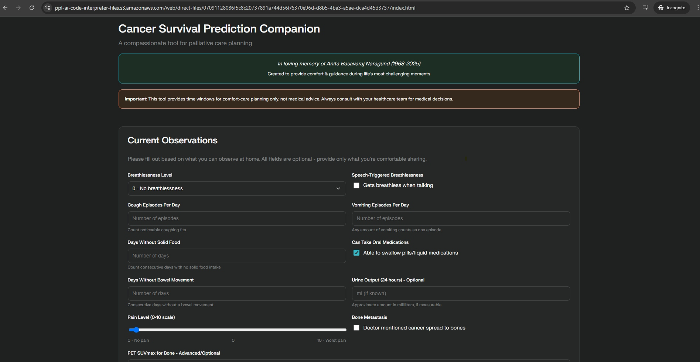
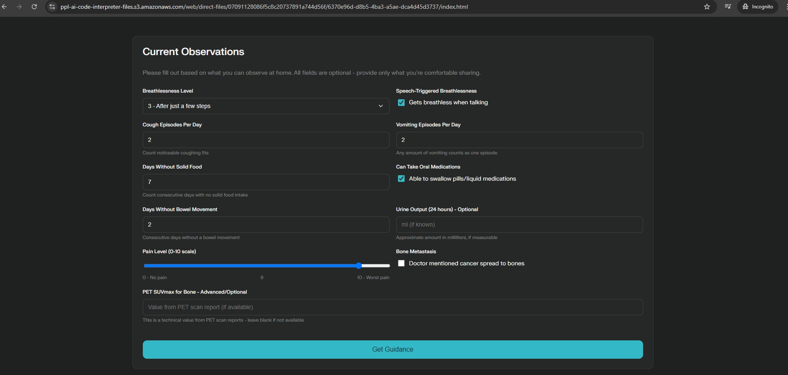
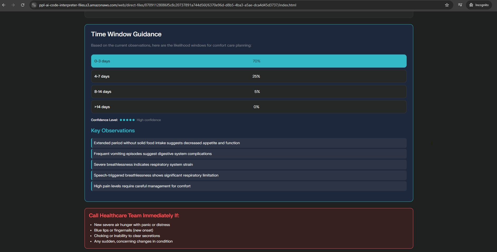
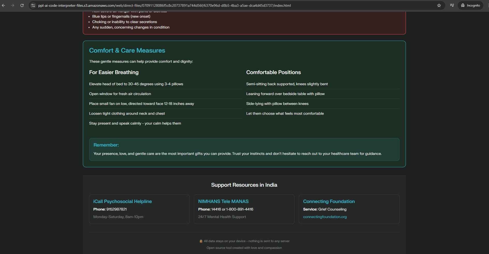

# 🌿 Cancer Survival Prediction Companion

<p align="center">
  
  
  
  
</p>

<p align="center">
  <b>A compassionate tool for palliative care planning and survival prediction.</b><br/>
  <sub>Built for education and research. Works fully offline.</sub>
</p>

---

## 📋 Table of Contents

- Project Overview
- How It Works
- Technologies Used
- Features
- Installation
- A to Z Usage Guide
- Code Structure
- Contributing
- License
- Credits
- Screenshots

---

## 🎯 Project Overview

Cancer Survival Prediction Companion is a web application that blends machine learning predictions with empathetic guidance to support informed, human-centered decision-making.

### Mission Statement
To provide accurate, compassionate survival predictions while upholding dignity and supporting thoughtful healthcare conversations.

### Key Objectives
- Deliver clinically relevant survival predictions
- Provide compassionate, supportive guidance
- Empower patients and families with knowledge
- Support healthcare providers in patient communication
- Maintain ethical standards in medical AI applications

---

## 🔍 How It Works

The application uses a Random Forest model trained on cancer patient data to predict 5-year survival based on patient and clinical parameters.

### Input Parameters
1. Age (years)
2. Gender
3. BMI (Body Mass Index)
4. Smoking Status
5. Alcohol Consumption
6. Cancer Type
7. Cancer Stage (I–IV)
8. Treatment Type
9. Genetic Markers
10. Comorbidities (count)
11. Treatment Response
12. Follow-up Frequency

### Prediction Process
1. Data Input: Provider enters parameters
2. Preprocessing: Validation and formatting
3. ML Inference: Random Forest classifier
4. Result Interpretation: Binary outcome (0/1)
5. Guidance Generation: Compassionate recommendations

---

## 🛠️ Technologies Used

### Frontend
- HTML5: Semantic structure
- CSS3: Gradients and animations
- JavaScript (ES6+): Interactivity

### Backend
- Python 3.8+
- Flask 2.0+
- scikit-learn
- NumPy & Pandas

### Model
- Algorithm: Random Forest Classifier
- Features: 12 clinical parameters
- Output: Binary survival prediction

### Development
- VS Code
- Git/GitHub
- pip

---

## ✨ Features

### Core Functionality
- 🎯 ML-Powered Predictions
- 📊 12-Parameter Input
- 💡 Compassionate Guidance
- 📱 Responsive Design
- ♿ Accessibility (WCAG 2.1)

### User Experience
- Clear, intuitive interface
- Real-time form validation
- Empathetic language and tone
- Resource recommendations
- Privacy-focused design

### Technical Features
- RESTful API architecture
- Real-time predictions
- Robust error handling
- Secure data processing
- Model persistence (joblib)

> Ethics Callout — Use Responsibly
> - Not for clinical decision-making
> - For education/research only
> - Always consult licensed clinicians

---

## 📥 Installation

### Prerequisites
- Python 3.8+  
- pip  
- Git

### Step 1: Clone Repository
```bash
git clone https://github.com/Gururaj-GJ/Cancer-Survival-Prediction-Companion.git
cd Cancer-Survival-Prediction-Companion
```

### Step 2: Create Virtual Environment
```bash
# Windows
python -m venv venv
venv\Scripts\activate

# macOS/Linux
python3 -m venv venv
source venv/bin/activate
```

### Step 3: Install Dependencies
```bash
pip install -r requirements.txt
```

### Step 4: Verify Installation
```bash
python --version   # Should be 3.8+
pip list           # Verify packages
```

### Step 5: Run Application
```bash
python app.py
```
Access at: http://127.0.0.1:5000

### Troubleshooting
- Port conflict: Change Flask port in app.py
- Missing packages: Re-run pip install -r requirements.txt
- Python version: Ensure 3.8+
- Model file: Ensure cancer_survival_model.pkl exists

---

## 📖 A to Z Usage Guide

### For Healthcare Providers
1) Access the app at http://127.0.0.1:5000 and review the disclaimer  
2) Input patient data across Demographics, Health Metrics, Clinical Information, and Treatment Details  
3) Click Predict Survival and review outcome and guidance  
4) Use results to facilitate supportive conversations and share resources

### For Patients & Families
- Statistical Nature: Predictions are estimates, not certainties
- Individual Variation: Every journey is unique
- Professional Guidance: Always consult your healthcare team
- Use Resources: Explore support and quality-of-life guidance

### Form Validation
- All fields required  
- Age: 0–120  
- BMI: 10–60  
- Comorbidities: 0–10  
- Real-time error messages

### Privacy & Security
- No data storage  
- No personal information collected  
- Session-based processing only  
- HIPAA-aware design principles

> Safety Callout — Privacy First
> - The tool processes data locally in-session  
> - Avoid entering personally identifiable information

---

## 📸 Screenshots

<p align="center">
  
  
  
</p>
<p align="center">
  <em>Mobile views: main interface, input form, results with compassionate guidance.</em>
</p>

<p align="center">
  
  
</p>
<p align="center">
  
  
</p>
<p align="center">
  <em>Desktop views: interface, form, results, and resources with comfortable margins.</em>
</p>

---

## 📁 Code Structure

```
Cancer-Survival-Prediction-Companion/
├── app.py                  # Flask entry point
├── cancer_survival_model.pkl
├── requirements.txt
├── README.md
├── templates/
│   ├── index.html          # Main page
│   └── result.html         # Prediction results
├── static/
│   ├── styles.css          # Styling
│   └── script.js           # Client logic
└── assets/
    └── images/             # Screenshots
```

### Key Files
- app.py: Routes, model loading, validation, responses
- templates/index.html: Form, accessibility, responsive layout
- templates/result.html: Display, conditional guidance, resources
- static/styles.css: Design system, responsive, accessibility
- static/script.js: Validation, interactivity, errors

---

## 🤝 Contributing

### Ways to Contribute
1. Report bugs  
2. Suggest features  
3. Improve documentation  
4. Enhance accessibility  
5. Add resources

### Process
1. Fork repo  
2. Branch: git checkout -b feature/YourFeature  
3. Commit: git commit -m "feat: add your feature"  
4. Push: git push origin feature/YourFeature  
5. Open a Pull Request

### Guidelines
- Compassionate, supportive language  
- Accessibility compliance  
- Cross-device testing  
- Document changes  
- Respect privacy

---

## 📄 License

MIT License — see LICENSE for details.

### Usage Terms
- ✅ Free for educational and research purposes
- ⚠️ Not FDA approved for clinical use
- ⚠️ Requires professional medical oversight
- ❌ Not a substitute for professional medical advice

> Ethics Callout — Human First
> Behind every data point is a human being with hopes, fears, and loved ones.

---

## 🙏 Credits

### Development
- Created by: Gururaj GJ  
- Purpose: Educational demonstration of ML in healthcare  
- Inspiration: Improving patient care through technology

### Acknowledgments
- scikit-learn community  
- Healthcare professionals for domain expertise  
- Patients and families who inspire compassionate care

### Disclaimer
⚠️ Important Medical Disclaimer  
This tool is for educational and informational purposes only. It is NOT:  
- A replacement for professional medical advice  
- FDA approved or clinically validated  
- Suitable for making treatment decisions  
- Guaranteed to be accurate for any individual  

Always consult qualified healthcare professionals for:  
- Diagnosis and treatment planning  
- Medical decision-making  
- Cancer care management  
- Palliative care decisions  

---

Contact  
- Email: gururaj.gj.guru@gmail.com  
- LinkedIn: https://www.linkedin.com/in/gururaj-gj/

<sub>Last Updated: October 2025</sub>
