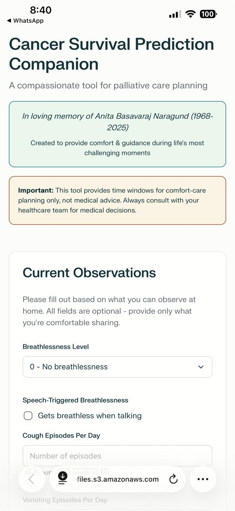
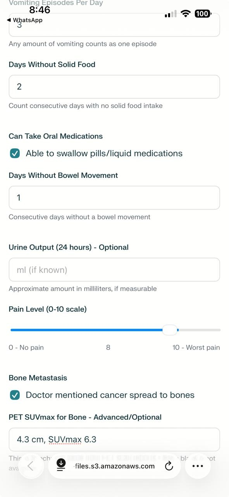
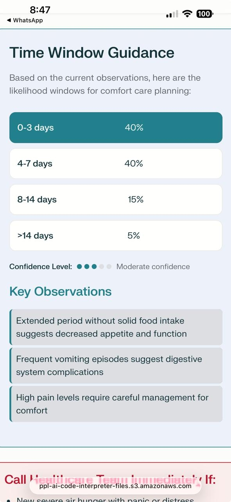
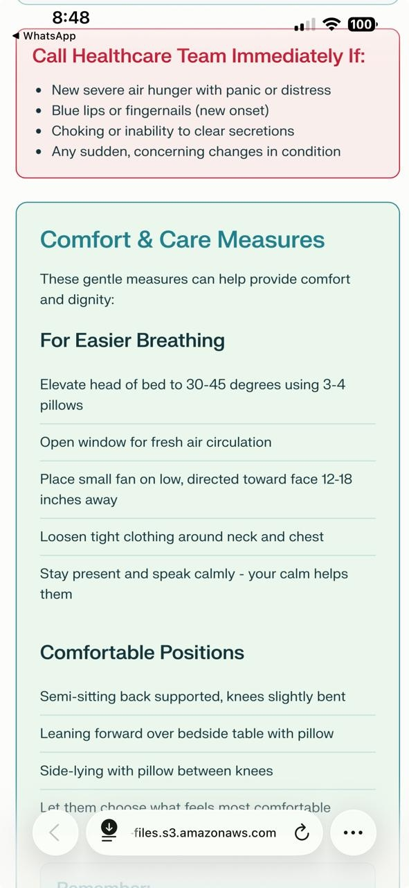
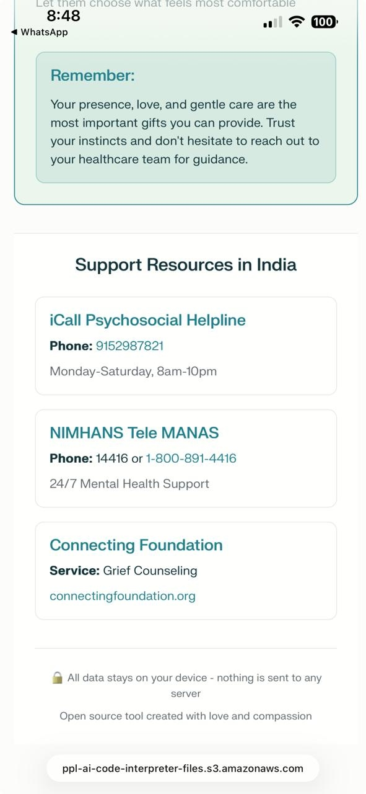

# Cancer Survival Prediction Companion

## 📋 Table of Contents
- [Project Overview](#-project-overview)
- [How It Works](#-how-it-works)
- [Technologies Used](#-technologies-used)
- [Features](#-features)
- [Installation](#-installation)
- [A to Z Usage Guide](#-a-to-z-usage-guide)
- [Code Structure](#-code-structure)
- [Contributing](#-contributing)
- [License](#-license)
- [Credits](#-credits)

## 🎯 Project Overview
... (content unchanged above) ...

## 📸 Screenshots

Mobile-responsive interface for easy data input on any device

Comprehensive input form for patient assessment parameters

Survival prediction results with compassionate guidance

Detailed care recommendations and quality of life considerations

Additional support information and family guidance resources

## 📄 License
... (content unchanged below) ...
